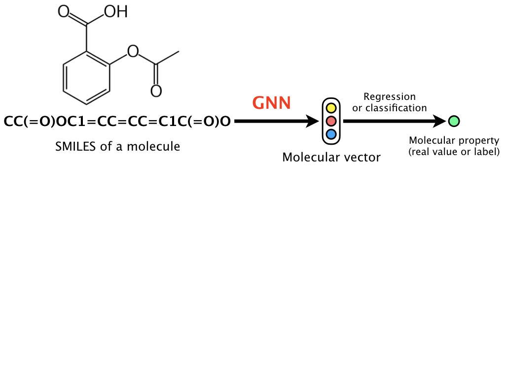
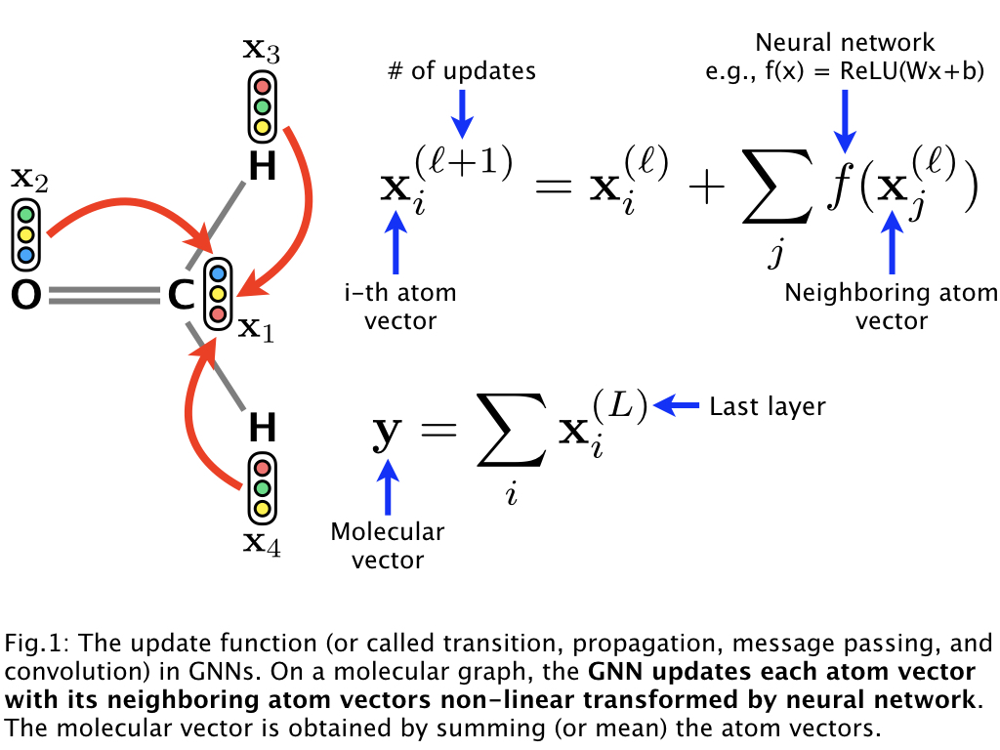
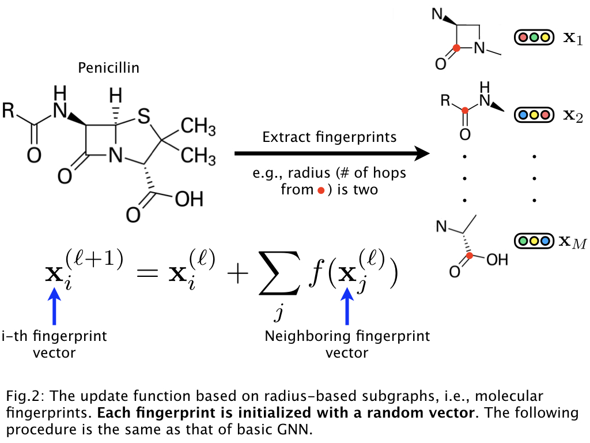
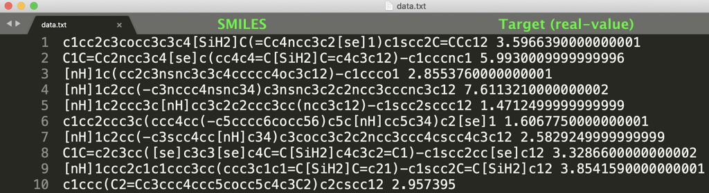

# Graph neural network (GNN) for molecular property prediction (SMILES format)

This is the code of a graph neural network (GNN) for molecules,
which is based on learning representations of r-radius subgraphs (or fingerprints) in molecules.
This GNN is proposed in our paper "[Compound-protein Interaction Prediction with End-to-end Learning of Neural Networks for Graphs and Sequences (Bioinformatics, 2018)](https://academic.oup.com/bioinformatics/advance-article-abstract/doi/10.1093/bioinformatics/bty535/5050020?redirectedFrom=PDF),"
which aims to predict compound-protein interactions for drug discovery.
Using the proposed GNN, in this page we provide an implementation of the model
for predicting various molecular properties such as drug efficacy and photovoltaic efficiency.

<div align="center">
<p></p>
</div>


## Characteristics

- This code is easy to use. After setting the environment (e.g., PyTorch),
preprocessing data and learning a model can be done by only two commands (see "Usage").
- If you prepare a molecular property dataset with the same format as provided in the dataset directory,
you can learn our GNN with your dataset by the two commands
(see "Training of our GNN using your molecular property dataset").


## Our GNN model

The basic idea of a GNN can be described as follows:

<div align="center">
<p></p>
</div>

The GNN (1) updates the randomly initialized atom vectors
considering the graph structure of a molecule,
(2) obtains the molecular vector, and then
(3) learns the neural network parameters including the atom vectors
via backpropagation to predict a molecular property.
That is, this is the end-to-end learning that does not require
input features or descriptors used in chemoinformatics.

In drug compounds, for example, each atom, chemical bond, and their connections
in a molecular graph are not so important.
More important in drug compounds is to consider
**relatively large fragments** in a molecular graph,
e.g., [β-lactam in penicillin](https://en.wikipedia.org/wiki/%CE%92-lactam_antibiotic).
Such fragments are referred to as r-radius subgraphs or **molecular fingerprints**.
Based on this observation, our GNN leverages molecular fingerprints
and the model can be described as follows:

<div align="center">
<p></p>
</div>

Thus, instead of using atom vectors, we
(1) extract the fingerprints from a molecular graph
and initialize them using random vectors,
(2) obtain the molecular vector by GNN, and then
(3) learn the representations.
This GNN allows us to learn the representations of molecular fingerprints.


## Requirements

- PyTorch
- scikit-learn
- RDKit


## Usage

We provide two major scripts in the main directory as follows.

- "preprocessing.py" creates tensor data from original text data (see dataset/././data.txt).
- "train.py" trains a GNN model using the preprocessed data to predict a molecular property.

You can easy to train a GNN model by the following commands.

Clone our repository,
```
git clone https://github.com/masashitsubaki/molecularGNN_smiles.git
```
change directory, 
```
cd molecularGNN_smiles/main
```
and run the bash file for training.
```
bash train.sh
```

You can also change the model hyperparameters described in train.sh (e.g., the dimensionality, number of hidden layers, and batch size). Try to learn various GNN models to find your own best model for your dataset!


## Learning a GNN with your dataset

In this repository, we provide two datasets of regression (see dataset/regression/photovoltaic/data.txt) and classification (see dataset/classification/HIV/data.txt) as follows:

<div align="center">
<p></p>
</div>

<div align="center">
<p></p>
</div>

If you prepare a dataset with the same format (any molecular property can be used!), you can learn a GNN model with your dataset.


## How to cite

```
@article{tsubaki2018compound,
  title={Compound-protein Interaction Prediction with End-to-end Learning of Neural Networks for Graphs and Sequences},
  author={Tsubaki, Masashi and Tomii, Kentaro and Sese, Jun},
  journal={Bioinformatics},
  year={2018}
}
```
