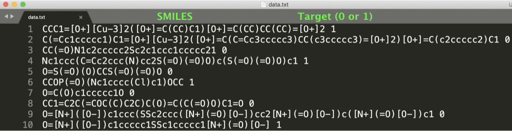

# Graph neural network (GNN) for molecules

This is a code of a graph neural network (GNN) for molecules, which is based on learning representations of r-radius subgraphs (or called fingerprints) in molecules.
This GNN is proposed in our paper "[Compound-protein Interaction Prediction with End-to-end Learning of Neural Networks for Graphs and Sequences (Bioinformatics, 2018)](https://academic.oup.com/bioinformatics/advance-article-abstract/doi/10.1093/bioinformatics/bty535/5050020?redirectedFrom=PDF)," which aims to predict compound-protein interactions for drug discovery. Using the proposed GNN, in this page we provide an implementation for predicting various molecular properties such as drug efficacy and photovoltaic efficiency.

<div align="center">
<p></p>
</div>


## Characteristics

- This code is easy to use. After setting the environment (e.g., PyTorch), preprocessing data and learning a model can be done by only two commands (see "Usage").
- If you prepare a dataset with the same format as provided in the dataset directory, you can learn our model with your dataset by the two commands (see "Training of our neural network using your molecular property dataset").


## Our GNN model

The basic idea of a GNN can be described as follows:

<div align="center">
<p></p>
</div>

The GNN updates the randomly initialized atom vectors in a molecule,
obtains the molecular vector, and then learns the parameters of the neural networks
including the atom vectors via backpropagation to predict the molecular properties
(i.e., this is an end-to-end learning without input features or descriptors used in chemoinformatics).

In drug compounds, for example, each atom, chemical bond, and their connections
in a molecular graph are not very important.
More important in drug compounds is to consider large fragments of molecular graphs,
e.g., [β-lactam in penicillin](https://en.wikipedia.org/wiki/%CE%92-lactam_antibiotic).
Such large fragments are called r-radius subgraphs or molecular fingerprints.
Based on this observation, our GNN leverages molecular fingerprints
and the model can be described as follows:

<div align="center">
<p></p>
</div>

Thus, instead of using atom vectors, we extract the fingerprints from a molecular graph,
initialize them using random vectors, and then learn the representations.
This leads to the representation learning for molecular fingerprints within the GNN.


## Requirements

- PyTorch
- scikit-learn
- RDKit


## Usage

We provide two major scripts:

- code/classification or regression/preprocess_data.py creates the input tensor data of molecules for processing with PyTorch from the original data (see dataset/classification or regression/original/smiles_property.txt).
- code/classification or regression/run_training.py trains our neural network using the above preprocessed data to predict molecular properties.

(i) Create the tensor data of molecules and their properties with the following command:
```
cd code/regression (or cd code/classification)
bash preprocess_data.sh
```
The preprocessed data are saved in the dataset/input directory.

(ii) Using the preprocessed data, train our neural network with the following command:
```
bash run_training.sh
```
The training result and trained model are saved in the output directory (after training, see output/result and output/model).

(iii) You can change the hyperparameters in preprocess_data.sh and run_training.sh.
Try to learn various models!


## Result

On the photovoltaic efficiency dataset,
the learning curve (x-axis is epoch and y-axis is error) is as follows:

<div align="center">
<p></p>
</div>

This result can be reproduce by the above two commands (i) and (ii).


## Training of our neural network using your molecular property dataset

In this repository, we provide two datasets of
classification (see dataset/classification/HIV/original/data.txt) and
regression (see dataset/regression/photovoltaic/original/data.txt) as follows:

<div align="center">
<p></p>
</div>

<div align="center">
<p></p>
</div>

If you prepare a dataset with the same format as "data.txt" in a new directory,
you can train our neural network using your dataset by the above two commands (i) and (ii).


## Future work

- Preprocess data that contains "." in the SMILES format (i.e., a molecule contains multi-graphs).
- Provide some pre-trained model and the demo script.


## How to cite

```
@article{tsubaki2018compound,
  title={Compound-protein Interaction Prediction with End-to-end Learning of Neural Networks for Graphs and Sequences},
  author={Tsubaki, Masashi and Tomii, Kentaro and Sese, Jun},
  journal={Bioinformatics},
  year={2018}
}
```
