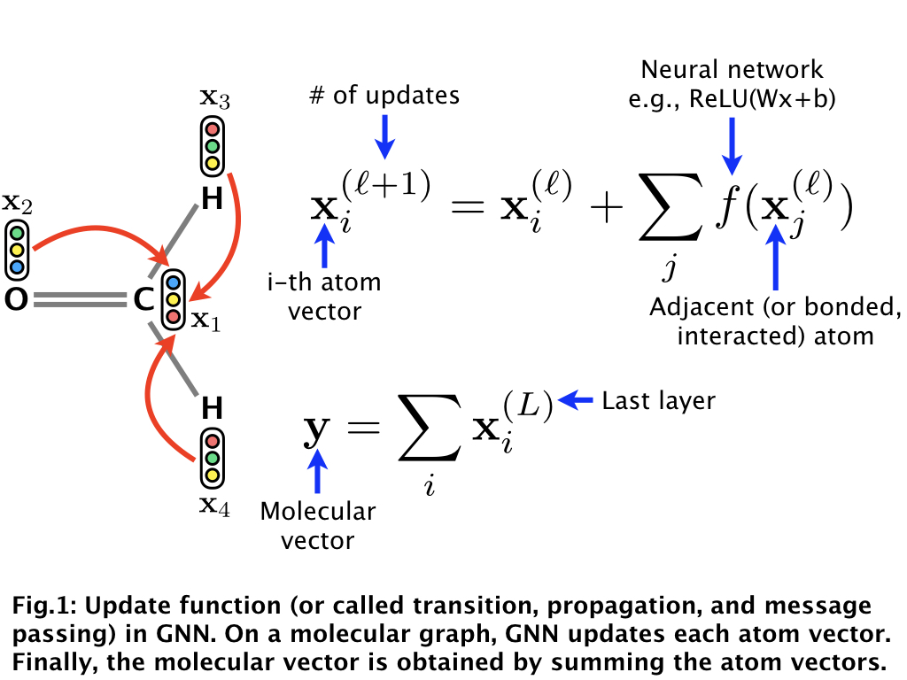
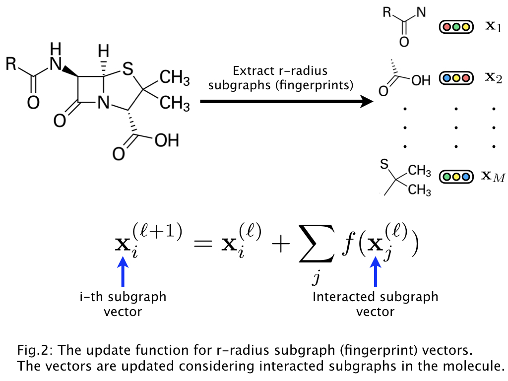

# Graph neural network (GNN) for molecules

This is a code of a graph neural network (GNN) for molecules, which is based on learning representations of r-radius subgraphs (or called fingerprints) in molecules.
This GNN is proposed in our paper "[Compound-protein Interaction Prediction with End-to-end Learning of Neural Networks for Graphs and Sequences (Bioinformatics, 2018)](https://academic.oup.com/bioinformatics/advance-article-abstract/doi/10.1093/bioinformatics/bty535/5050020?redirectedFrom=PDF)," which aims to predict compound-protein interactions for drug discovery. In this implementation, using the proposed GNN we provide a model for predicting various molecular properties such as drug efficacy and photovoltaic efficiency.


## Characteristics

- This code is easy to use. After setting the environment (e.g., PyTorch), preprocessing data and learning a model can be done by only two commands (see "Usage").
- If you prepare dataset with the same format as provided in the dataset directory, you can learn our model with your dataset by the two commands (see "Training of our neural network using your molecular property dataset").


## Our GNN model

The basic idea of a GNN can be described as follows:

<div align="center">
<p></p>
</div>

The GNN updates the randomly initialized atom vectors in a molecule,
obtains the molecular vector, and then learns the parameters of the neural networks
including the atom vectors via backpropagation to predict molecular properties
(i.e., this is the end-to-end learning of GNN).

Our GNN, based on the r-radius subgraphs (or fingerprints), can be described as follows:

<div align="center">
<p></p>
</div>

This leads to the representation learning for r-radius subgraphs (or fingerprints) in molecules.


## Requirements

- PyTorch (version 0.4.0)
- scikit-learn
- RDKit


## Usage

We provide two major scripts:

- code/classification or regression/preprocess_data.py creates the input tensor data of molecules for processing with PyTorch from the original data (see dataset/classification or regression/original/smiles_property.txt).
- code/classification or regression/run_training.py trains our neural network using the above preprocessed to predict molecular properties.

(i) Create the tensor data of molecules and their properties with the following command:
```
cd code/classification (or cd code/regression)
bash preprocess_data.sh
```

(ii) Using the preprocessed data, train our neural network with the following command:
```
bash run_training.sh
```

The training result and trained model are saved in the output directory (after training, see output/result and output/model).

(iii) You can change the hyperparameters in preprocess_data.sh and run_training.sh. Try to learn various models!


## Training of our neural network using your molecular property dataset
In this repository, we provide a dataset of classification (see dataset/classification/HIV)
and regression (see dataset/regression/photovoltaic).
If you prepare dataset with the same format as "smiles_property.txt" in a new directory,
you can train our neural network using your dataset by the above two commands (i) and (ii).


## How to cite

```
@article{tsubaki2018compound,
  title={Compound-protein Interaction Prediction with End-to-end Learning of Neural Networks for Graphs and Sequences},
  author={Tsubaki, Masashi and Tomii, Kentaro and Sese, Jun},
  journal={Bioinformatics},
  year={2018}
}
```
