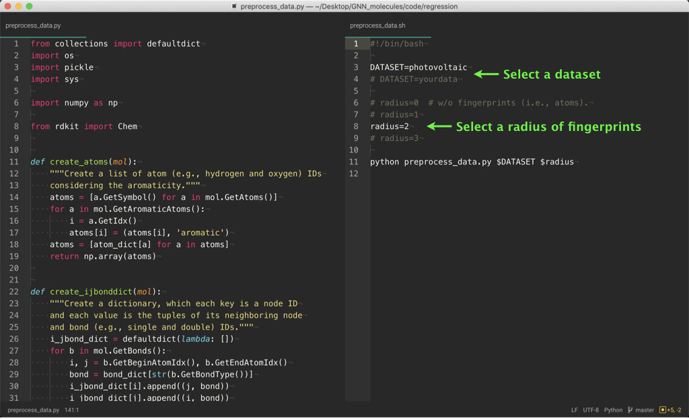
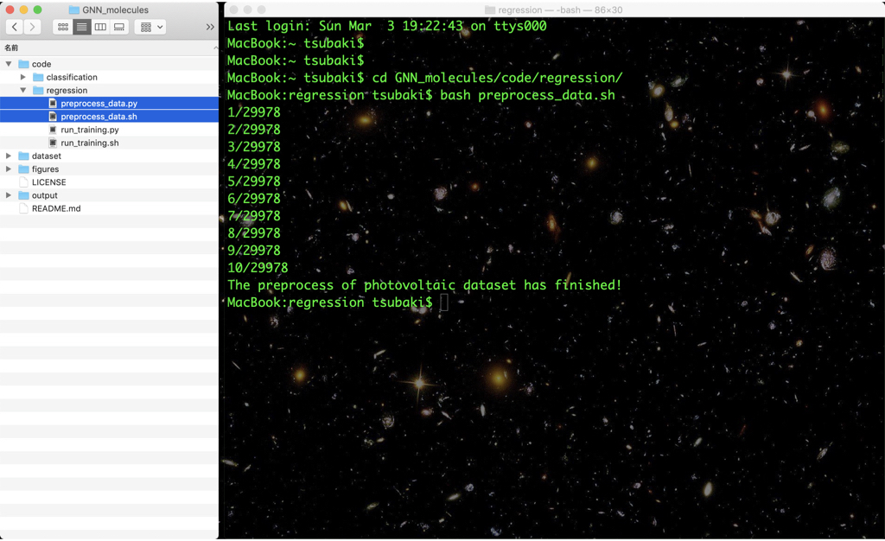
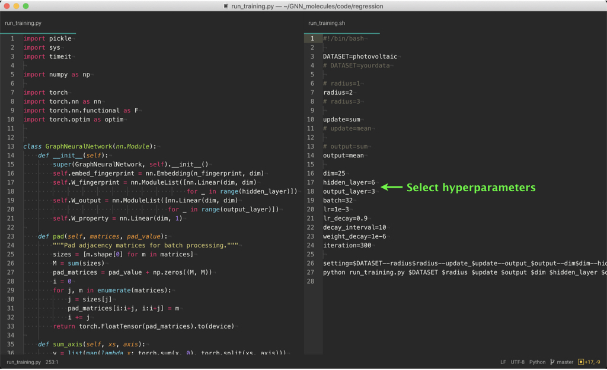
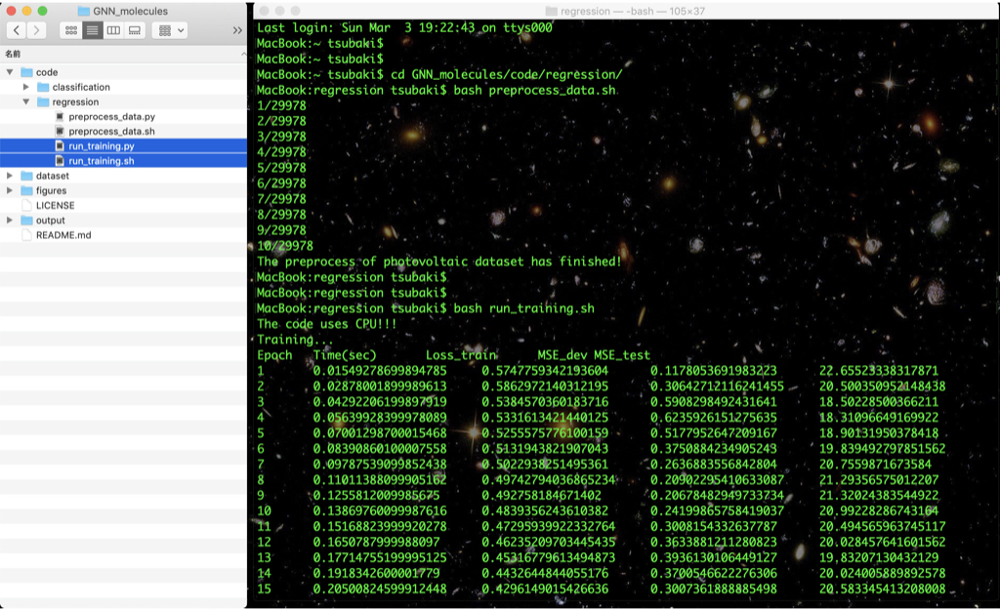
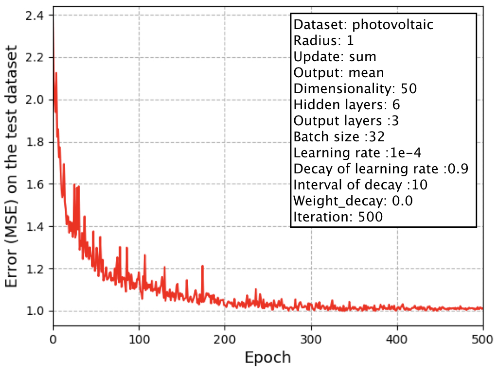

# Graph neural network (GNN) for molecules

This is the code of a graph neural network (GNN) for molecules,
which is based on learning representations of r-radius subgraphs (or fingerprints) in molecules.
This GNN is proposed in our paper "[Compound-protein Interaction Prediction with End-to-end Learning of Neural Networks for Graphs and Sequences (Bioinformatics, 2018)](https://academic.oup.com/bioinformatics/advance-article-abstract/doi/10.1093/bioinformatics/bty535/5050020?redirectedFrom=PDF),"
which aims to predict compound-protein interactions for drug discovery.
Using the proposed GNN, in this page we provide an implementation of the model
for predicting various molecular properties such as drug efficacy and photovoltaic efficiency.

<div align="center">
<p></p>
</div>


## Characteristics

- This code is easy to use. After setting the environment (e.g., PyTorch),
preprocessing data and learning a model can be done by only two commands (see "Usage").
- If you prepare a molecular property dataset with the same format as provided in the dataset directory,
you can learn our GNN with your dataset by the two commands
(see "Training of our GNN using your molecular property dataset").


## Our GNN model

The basic idea of a GNN can be described as follows:

<div align="center">
<p></p>
</div>

The GNN (1) updates the randomly initialized atom vectors
considering the graph structure of a molecule,
(2) obtains the molecular vector, and then
(3) learns the neural network parameters including the atom vectors
via backpropagation to predict a molecular property.
That is, this is the end-to-end learning that does not require
input features or descriptors used in chemoinformatics.

In drug compounds, for example, each atom, chemical bond, and their connections
in a molecular graph are not so important.
More important in drug compounds is to consider
**relatively large fragments** in a molecular graph,
e.g., [β-lactam in penicillin](https://en.wikipedia.org/wiki/%CE%92-lactam_antibiotic).
Such fragments are referred to as r-radius subgraphs or **molecular fingerprints**.
Based on this observation, our GNN leverages molecular fingerprints
and the model can be described as follows:

<div align="center">
<p></p>
</div>

Thus, instead of using atom vectors, we
(1) extract the fingerprints from a molecular graph
and initialize them using random vectors,
(2) obtain the molecular vector by GNN, and then
(3) learn the representations.
This GNN allows us to learn the representations of molecular fingerprints.


## Requirements

- PyTorch
- scikit-learn
- RDKit


## Usage

We provide two major scripts:

- code/regression or classification/preprocess_data.py creates
the input tensor data of molecules for processing with PyTorch
from the original data (see dataset/regression or classification/original/data.txt).

- code/regression or classification/run_training.py trains our GNN
using the above preprocessed data to predict a molecular property.

### (1) Preprocess data

<div align="center">


</div>

Create the tensor data of molecules and their properties with the following command:
```
cd code/regression (or cd code/classification)
bash preprocess_data.sh
```
The preprocessed data are saved in the dataset/input directory.

### (2) Run training

<div align="center">


</div>

Using the preprocessed data, train our GNN with the following command:
```
bash run_training.sh
```
The training and test results and the GNN model are saved in the output directory
(after training, see output/result and output/model).

You can change the hyperparameters in
preprocess_data.sh and run_training.sh as described in the above figures.
Try to learn various models!


## Result

On the photovoltaic efficiency dataset in the directory of dataset/regression,
the learning curve (x-axis is epoch and y-axis is error) is as follows:

<div align="center">
<p></p>
</div>

This result can be reproduce by the above two commands (1) and (2).


## Training of our GNN using your molecular property dataset

In this repository, we provide two datasets of
regression (see dataset/regression/photovoltaic/original/data.txt) and
classification (see dataset/classification/HIV/original/data.txt) as follows:

<div align="center">
<p></p>
</div>

<div align="center">
<p></p>
</div>

If you prepare a dataset with the same format as "data.txt" in a new directory
(e.g., dataset/yourdata/original),
you can train our GNN using your dataset by the above two commands (1) and (2).


## TODO

- Preprocess data contains "." in the SMILES format (i.e., a molecule contains multi-graphs).
- Provide some pre-trained model and the demo scripts.


## How to cite

```
@article{tsubaki2018compound,
  title={Compound-protein Interaction Prediction with End-to-end Learning of Neural Networks for Graphs and Sequences},
  author={Tsubaki, Masashi and Tomii, Kentaro and Sese, Jun},
  journal={Bioinformatics},
  year={2018}
}
```
